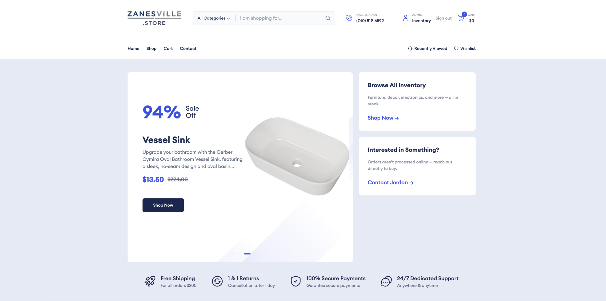

# Zanesville.Store

Personal inventory showcase for Jordan Lang in Zanesville, Ohio. It's an online catalog — **not a real checkout**. Visitors browse available items and contact Jordan directly to buy.

Live at **[zanesville.store](https://www.zanesville.store)**.



## Stack

- **Next.js 15** (App Router, React 19)
- **Prisma 6** on **PostgreSQL** (Neon)
- **NextAuth v4** with credentials + Prisma adapter (bcrypt-hashed passwords)
- **Tailwind CSS 3**, Redux Toolkit, Swiper
- **Vercel** for hosting; **Neon** GitHub Action provisions a preview branch per PR

## Project layout

```
src/app/(site)/(pages)/
  admin/            -> inventory management (auth-gated)
  shop/             -> public catalog
  shop-details/     -> product page
  sold/             -> recently sold archive
  signin, signup, my-account
  cart, checkout    -> demo-only flow
  contact
src/components/     -> UI (Admin, Auth, Shop, Header, Footer, …)
src/lib/            -> auth.ts, prisma.ts, productCatalog.ts, validation
prisma/             -> schema + migrations
scripts/            -> create-admin, export/import data, Amazon enrichment
```

## Getting started

Prereqs: Node 20+, npm, a Postgres URL (Neon free tier is fine).

```bash
git clone https://github.com/jordolang/Zanesville.Store.git
cd Zanesville.Store
cp .env.example .env.local   # set DATABASE_URL, DATABASE_URL_UNPOOLED, NEXTAUTH_SECRET, ADMIN_EMAIL, ADMIN_PASSWORD
npm install
npx prisma migrate deploy
npm run db:create-admin      # seeds the single admin user
npm run dev
```

Open <http://localhost:3000>. The admin panel is at `/admin` and requires a signed-in user whose email matches `ADMIN_EMAIL`.

### Required environment variables

| Variable | Purpose |
|---|---|
| `DATABASE_URL` | Pooled Postgres connection (runtime) |
| `DATABASE_URL_UNPOOLED` | Direct Postgres connection (migrations, long imports) |
| `NEXTAUTH_URL` | Deployed URL (e.g. `https://www.zanesville.store`) |
| `NEXTAUTH_SECRET` | NextAuth JWT secret |
| `ADMIN_EMAIL` | Email that unlocks `/admin` |
| `ADMIN_PASSWORD` | Password used by `db:create-admin` |
| `CONTACT_TO_EMAIL` | Where contact form submissions are sent |

## Scripts

| Command | What it does |
|---|---|
| `npm run dev` | Next dev server |
| `npm run build` | `prisma migrate deploy && next build` (auto-applies schema on deploy) |
| `npm run start` | Production server |
| `npm run lint` | Next lint |
| `npm run db:generate` | `prisma generate` |
| `npm run db:push` | `prisma db push` (dev-only schema sync) |
| `npm run db:migrate` | `prisma migrate dev` |
| `npm run db:seed` | Seed categories/products from the unified seed script |
| `npm run db:create-admin` | Upsert the admin user (reads `ADMIN_EMAIL` / `ADMIN_PASSWORD`) |
| `tsx scripts/export-data.ts` | Dump the current DB to `prisma/sqlite-dump.json` |
| `tsx scripts/import-data.ts` | Wipe and repopulate the target DB from that dump |

## Admin panel

`/admin` lets the admin:
- Edit titles, prices, MSRP, sale price, description, brand, and image URLs inline.
- Toggle products between Active and Sold (Sold items appear on `/sold`).
- Page through inventory at 10 / 25 / 50 rows per page (default 25).
- Search and filter by Active / Sold / All.

## Deployment

Deployed on Vercel. Every push to `main` triggers a build that runs `prisma migrate deploy` against the Neon production branch before `next build`.

The Neon PR workflow (`.github/workflows/neon_workflow.yml`) creates a scoped Neon branch for each PR and deletes it when the PR closes. It needs these repo settings:

- Variable: `NEON_PROJECT_ID`
- Secret: `NEON_API_KEY`

## Contact

For inventory questions: **(740) 647-2461** or the contact form at <https://www.zanesville.store/contact>.
